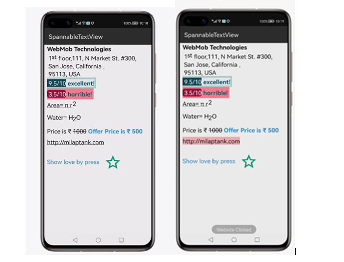

# SpannableTextView
[](https://sonarcloud.io/dashboard?id=applibgroup_SpannableTextView)
[](https://github.com/applibgroup/SpannableTextView/actions/workflows/main.yml)
 
## Introduction
 
###### SpannableTextView is a custom `TextView` which lets you customize the styling of SpannableStyles of your text or statment via `Spannables`, but without the hassle of having to deal directly with Spannable themselves.

## Source
 
###### The code in this repository was inspired from [milaptank/SpannableTextView - v1.0.0](https://github.com/milaptank/SpannableTextView). We are very thankful to milaptank.

## Screenshot

 
 &nbsp;&nbsp;&nbsp;&nbsp;&nbsp;&nbsp;&nbsp;&nbsp;&nbsp;&nbsp;&nbsp;&nbsp;&nbsp;&nbsp;&nbsp;&nbsp;
 
 
 &nbsp;&nbsp;&nbsp;&nbsp;&nbsp;&nbsp;&nbsp;&nbsp;&nbsp;&nbsp;&nbsp;&nbsp;&nbsp;&nbsp;&nbsp;&nbsp;

## Installation

In order to use the following library, add the following line to your **root** gradle file:

1.For using SpannableTextView module in sample app, include the source code and add the below dependencies in entry/build.gradle to generate hap/support.har.

```
dependencies{
    implementation fileTree(dir: 'libs', include: ['*.jar', '*.har'])
    implementation project(path: ':spannabletextview')
    testImplementation 'junit:junit:4.13'
}
```
2.For using SpannableTextView in separate application using har file, add the har file in the entry/libs folder and add the dependencies in entry/build.gradle file.

```
dependencies {
    implementation fileTree(dir: 'libs', include: ['*.har'])
    testCompile 'junit:junit:4.12'
}
```
3.For using SpannableTextView from a remote repository in separate application, add the below dependencies in entry/build.gradle file.

```
dependencies {
    implementation 'dev.applibgroup:spannabletextview:1.0.0'
    testImplementation 'junit:junit:4.13'
}
```
​
## Usage

Generate the following style:

## Screenshot

 
 &nbsp;&nbsp;&nbsp;&nbsp;&nbsp;&nbsp;&nbsp;&nbsp;&nbsp;&nbsp;&nbsp;&nbsp;&nbsp;&nbsp;&nbsp;&nbsp;

With the code below:

```
    Java
    stvMarksDown.addSlice(new SpannableStyles.Builder(this.getResourceManager()
                    .getElement(ResourceTable.String_stvMarksDown).getString())
                    .backgroundColor(RgbPalette.parse(this.getResourceManager()
                    .getElement(ResourceTable.Color_customized_burgundy).getString()))
                    .textColor(Color.WHITE.getValue())
                    .setCornerRadius(13)
                    .build());
            stvMarksDown.display();
            stvMarksDownText.addSlice(new SpannableStyles.Builder(this.getResourceManager()
                    .getElement(ResourceTable.String_stMrksDTxt).getString())
                    .textColor(RgbPalette.parse(this.getResourceManager()
                    .getElement(ResourceTable.Color_customized_darkblue).getString()))
                    .style(Font.BOLD)
                    .build());
            stvMarksDownText.display();
```

What kind of styles can I add?
--------
Right now you can customize the style of your text by using the following methods, which internally
get converted to the corresponding `spannableS`

| SpannableTextView         | Internal Span           |
| ------------- |:-------------:|
| textSize      | setTextSize() |
| textColor      | setTextColor()      |
| textSizeRelative | RelativeSizeSpan      |
| style | setTextFont()      |
| underline | setUnderline()      |
| strike | setStrikethrough()      |

What else can I do?
--------
Once you've created and displayed your SpannableTextView, you can modify the text contents of each
`SpannableStyles` individually. For example, if we want to change the `3.5/10` from the above example into
`6/10`, we could do the following:

```
    java
    {
      "name": "stvMarksDown",
      "value": " 6/10   "
    }
```
## Support & extension

Currently there is a limitation to set subscript,superscript,backgroundColor and ImageResource. So subscript,superscript,backgroundColor and ImageResource cannot be set from sample app to Spans.

### License
```
MIT License

Copyright (c) 2017 milap tank

Permission is hereby granted, free of charge, to any person obtaining a copy
of this software and associated documentation files (the "Software"), to deal
in the Software without restriction, including without limitation the rights
to use, copy, modify, merge, publish, distribute, sublicense, and/or sell
copies of the Software, and to permit persons to whom the Software is
furnished to do so, subject to the following conditions:

The above copyright notice and this permission notice shall be included in all
copies or substantial portions of the Software.

THE SOFTWARE IS PROVIDED "AS IS", WITHOUT WARRANTY OF ANY KIND, EXPRESS OR
IMPLIED, INCLUDING BUT NOT LIMITED TO THE WARRANTIES OF MERCHANTABILITY,
FITNESS FOR A PARTICULAR PURPOSE AND NONINFRINGEMENT. IN NO EVENT SHALL THE
AUTHORS OR COPYRIGHT HOLDERS BE LIABLE FOR ANY CLAIM, DAMAGES OR OTHER
LIABILITY, WHETHER IN AN ACTION OF CONTRACT, TORT OR OTHERWISE, ARISING FROM,
OUT OF OR IN CONNECTION WITH THE SOFTWARE OR THE USE OR OTHER DEALINGS IN THE
SOFTWARE.
```
